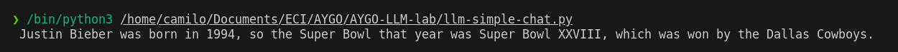
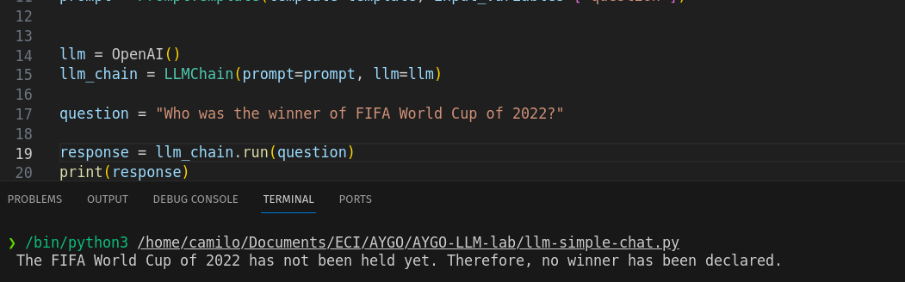
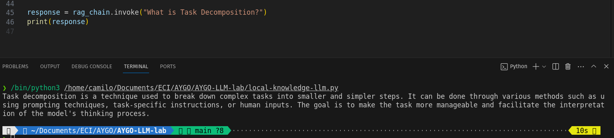
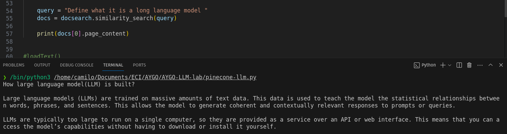

# AREP-IaC LAB- Web app automatically deployed to AWS
## Descripción


## Pre-requisitos
### Herramientas
* [Pip](https://pypi.org/project/pip/) - Administrador de paquetes de python
* [Python > 3.10.0](https://www.python.org/) - Lenguaje de programación
* [Git](https://git-scm.com/) - Sistema de control de versiones
  

## Instrucciones de ejecución
### Intalar las dependencias
Ejecutar el siguiente comando para instalar las dependencias del proyecto

`pip install -r requirements.txt`

### Configurar variables de entorno
Ejecute los siguientes comandos reemplazando los valores de las variables de entorno por sus llaves de OPENAI y PINECONE

```
export OPENAI_API_KEY={YOUR_OPENAI_KEY}
export PINECONE_API_KEY={YOUR_PINECONE_API_KEY}
export PINECONE_ENV={YOUR_PINECONE_ENV}
```
### Ejecución
Puede ejecutar cualquiera de los scripts del laboratorio usando el siguiente comando

`python3 {scriptname}.py `


## Experimentos

### LLM simple chat
Este experimento esta configurado para simplemente consumir la API de OpenAI, realizando una pregunta simple sobre un hecho del pasado, esta información está presente en el modelo puesto que fue entrenado con datos de internet hasta 2021.

Si se intentara preguntar por hechos después de esta fecha el modelo no sería capaz de generar una respuesta.
**Ejemplo con datos previos a 2021**

**Ejemplo con datos posteriores a 2021**


### Local knowledge llm
Dadas las limitaciones del modelo para analizar información posterior a 2021 o información confidencial que no se utilizó originalmente para el entrenamiento del modelo, se pueden utilizar bases de datos propias, estas bases de datos contienen representaciones vectorizadas de los documentos que se utilicen para el entrenamiento. Estas representaciones vectorizadas se construyen separando el archivo en distintos fragmentos (chunks) y generando vectores a partir de estos chunks, lo que hace el modelo al intentar buscar información es una búsqueda en el espacio vectorial, con el objetivo en encontrar el vector con mejor similitud a la pregunta solicitada.
En este experimento se utiliza una base de datos local y se carga con un artículo publicado en 2023 y disponible en la web.



### Pinecone LLM
En el tercer experimento se hizo una versión similar a la realizara en el segundo experimento, pero esta vez se utilizará una base de datos en la nube, en este caso utilizando pinecone. Este servicio nos provee una base de datos de vectores en la nube, lo que nos permite consultar el modelo desde internet, entrenando una sola vez y luego consultando múltiples veces desde distintos dispositivos

En este experimento se tomó un artículo sobre LLM de internet y se almacenó en el archivo `example.txt`, este archivo se cargó en la base de datos y a partir de ahí es posible realizarle preguntas, en este caso las respuestas corresponden con los vectores que más se asimilan a la pregunta realizada



## Conclusiones

Los Long Language Models (LLMs) Son herramientas muy útiles para facilitar la extracción de información de distintos tipos de documentos, es una tecnología que se puede aplicar a muchos casos de uso. Sin embargo es necesario evaluar las estrategias para entrenar y mantener actualizado el modelo, los templates para obtener las respuestas óptimas para cada caso de uso, etc.

